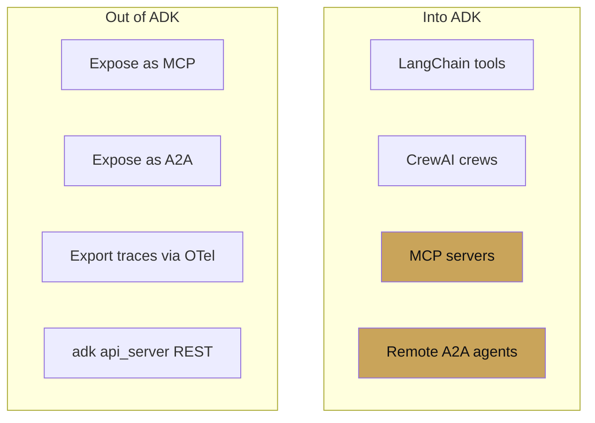

# Chapter 16 — Interop

chapter 16 · playing well with others

ADK is designed to coexist with other agent frameworks, not replace
them. The three open protocols — **MCP** for tools, **A2A** for
agents, **OpenTelemetry** for tracing — are the interop surface.

This chapter covers both directions: using non-ADK things inside
ADK, and exposing ADK things to non-ADK callers.

| Page | Covers |
|---|---|
| [MCP](mcp.md) | Tools in both directions |
| [A2A](a2a.md) | Agents across process and framework |
| [LangChain/LangGraph bridge](langchain-langgraph-bridge.md) | Using LC tools in ADK; wrapping ADK for LC |
