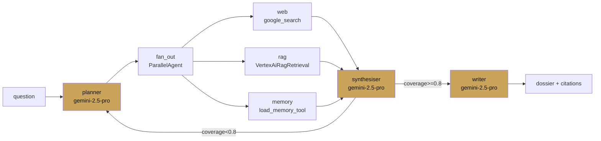

# Case study — Research assistant

<span class="kicker">ch 18 · page 2 of 3</span>

A research assistant for an analyst team. Takes a question, plans,
searches the web and the company's RAG corpus, and produces a
cited report that reliably cites what it actually used.

---

## Architecture



## Build choices

- **LoopAgent around the fan-out + synthesiser** with a coverage
  threshold. Max 3 iterations. Empirically, 1 iteration suffices
  70% of the time; 2 suffice 95%.
- **Pro on the ends, Flash in the middle** (covered in Chapter 15).
- **Memory used for cross-question continuity.** Earlier research
  the same analyst did on related topics is preloaded.
- **Hallucination eval in CI.** Every claim in the final report must
  map to a note from the researchers.

## Numbers

- 35-turn average session (each iteration is 5-10 events).
- 18s median end-to-end for a complete report.
- $0.12 per report with prompt caching; $0.28 without.
- Hallucination rate 2.1% on the regression eval (down from 8%
  before the coverage-threshold loop).

## What the LoopAgent buys

Without the loop, the system produced acceptable reports most of
the time but had a long tail of incomplete answers. Bounded
refinement cut the incomplete rate by 4x without hurting latency
for the simple cases.

## What went wrong, fixed

- **Citation hallucination.** The writer sometimes invented
  [1], [2] markers without corresponding sources. Fix: the writer
  now takes a structured `citations` list in its input and the
  instruction refuses to emit a marker that is not in the list.
- **Researcher collision on shared state.** Three parallel
  researchers initially wrote to `notes`; last-write-wins is
  non-deterministic. Split into `web_notes`, `rag_notes`,
  `memory_notes`.

---

## Code sketch

Full code in [`examples/11-deep-research`](https://github.com/vmishra/Google-ADK-Cookbook/tree/main/examples/11-deep-research).

```python
from google.adk.agents import LlmAgent, SequentialAgent, ParallelAgent, LoopAgent

fan_out = ParallelAgent(name="fan_out",
    sub_agents=[web_researcher, rag_researcher, memory_researcher])

loop = LoopAgent(name="refine",
    sub_agent=SequentialAgent(name="one_pass",
        sub_agents=[fan_out, synthesiser]),
    max_iterations=3)

root_agent = SequentialAgent(name="research",
    sub_agents=[planner, loop, writer])
```
