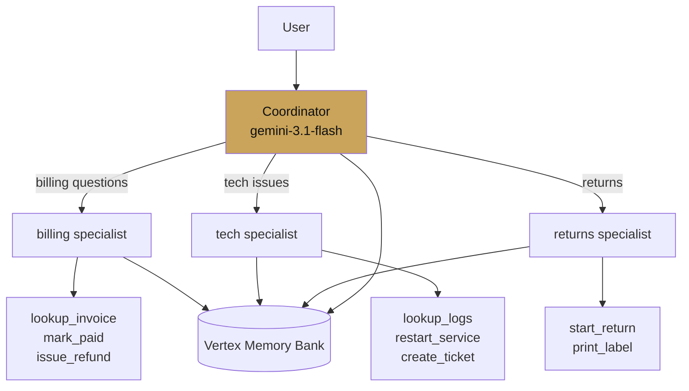

# Case study — Support triage

<span class="kicker">ch 18 · page 1 of 3</span>

A customer support system handling 5,000 concurrent sessions. Front
desk classifies, specialists answer, memory carries context across
sessions for returning customers.

---

## Architecture



## Build choices

- **Coordinator on Flash**, specialists on Flash. Pro only for the
  complex tech cases — a separate `tech_hard` sub-agent invoked
  from `tech` via `AgentTool`.
- **Session service** = `VertexAiSessionService`. Rewind is used
  by support agents to replay conversations they want to fix.
- **Memory** = `VertexAiMemoryBankService`, preload-enabled for
  returning customers.
- **Runner** = behind `adk api_server` on Cloud Run, autoscaled to
  50 instances.

## Numbers

- Peak: 1,800 concurrent sessions, 95th-percentile latency 1.9s.
- Cost: ~$0.004 per turn at steady state with prompt caching.
- Tool call rate: 2.3 tool calls per turn average; 5.1 per session.

## Learned the hard way

- **The first cost blowup was long sessions with no compaction.**
  A single pattern — users who leave a chat open all day — was
  accumulating 300+ turns in context. Compaction every 40 turns
  cut session cost by 60%.
- **Memory pollution.** Early version saved every session to
  memory. Too much noise. Moved to an explicit `save_to_memory`
  tool the coordinator calls when the user says something
  preference-like. Signal quality jumped.
- **The coordinator kept answering instead of transferring.**
  Fix: tighten the coordinator instruction to require a transfer
  for anything non-trivial. *"If in doubt, transfer to billing."*

## What would be worse in LangGraph or CrewAI

- **Session persistence.** Would be per-team plumbing.
- **Memory with extraction.** Vertex Memory Bank has no direct
  equivalent in the other frameworks; you would run your own.
- **Rewind for investigation.** Not natively in either.

---

## Code sketch

```python
from google.adk.agents import LlmAgent
from google.adk.tools.load_memory_tool import load_memory_tool

billing = LlmAgent(name="billing", model="gemini-3.1-flash",
    description="Invoices, charges, refunds.",
    instruction="...", tools=[...])

tech = LlmAgent(name="tech", model="gemini-3.1-flash",
    description="Technical issues with the product.",
    instruction="If the problem is hardware or config, escalate to tech_hard.",
    tools=[...], sub_agents=[tech_hard])

returns = LlmAgent(name="returns", model="gemini-3.1-flash",
    description="Return and RMA requests.",
    instruction="...", tools=[...])

root_agent = LlmAgent(
    name="front_desk", model="gemini-3.1-flash",
    instruction="Classify and transfer. Do not answer specialised questions.",
    sub_agents=[billing, tech, returns],
    tools=[load_memory_tool],
)
```
