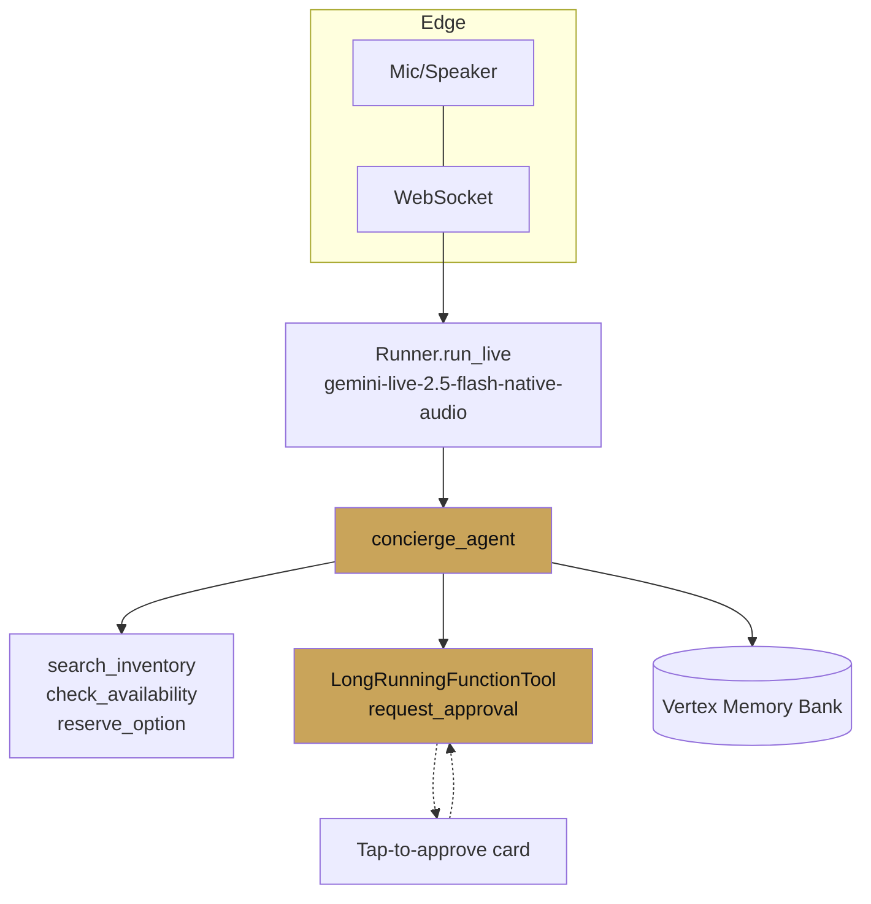

# Case study — Voice concierge

ch 18 · page 3 of 3

A voice concierge for a high-touch travel product. Users speak;
the agent searches, reserves, and — when it is about to spend
money — pauses for the user to approve with a single tap.

---

## Architecture

## Build choices

- **Live model** for bidirectional audio.
- **Cloud Run** (not Agent Engine) because of WebSockets.
- **Approval for anything that spends money.** `reserve_option` is a
  no-op without `request_approval` succeeding first — enforced at
  the tool-gate callback as well as in the instruction.
- **Interruption handling** on the client: when new audio events
  arrive, cancel any queued playback.
- **Memory** to remember user preferences across calls.

## Numbers

- ~800ms end-to-end echo latency for normal turns.
- +1.4s when a tool call fires mid-turn. Acceptable for this
  product; users are told "checking availability" by the model.
- Approval card tap-through rate: 94%. The 6% left are quiet
  rejections that the agent handles gracefully.

## What the live API buys

The canonical alternative — STT → text agent → TTS — adds ~800ms
at each layer. Native audio cuts the round trip by a factor of
~2x and gives interruption for free.

## Failure modes to design for

- **Network blips drop a WebSocket.** Session resumption via
  `SessionResumptionConfig` — the user reconnects within seconds
  and resumes where they were.
- **Ambient noise triggers false wakeup.** The model's VAD handles
  most of this; the rest is a client-side noise gate.
- **User interrupts the approval card.** The `after_model_callback`
  observes the interrupted state and re-announces the approval at
  the next pause.

## What would be worse in the alternatives

- **Live audio in LangChain/LangGraph.** You would be building the
  bridge between a TTS/STT pipeline and the agent yourself.
- **Interruption handling.** Native to Gemini Live; user-land in
  any DIY stack.
- **Federation with the room-management agent (a sibling
  non-concierge agent).** A2A makes it trivial; non-ADK paths are
  bespoke HTTP.

---

## Chapter recap

Three architectures, three different levers. What ties them is that
the *shape* of an ADK solution is always: agents composed, tools
wired, services swapped for managed, evaluation in CI, deployment
by CLI.

Next: [Chapter 19 — ADK as a harness platform](../19-harness-platform/index.md)
— the chapter for readers who want to build the platform on which
other teams will build agents.
