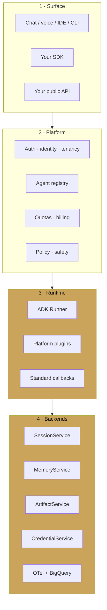

# Building a harness

<span class="kicker">ch 19 · page 1 of 6</span>

The reference architecture. Four layers, each a boundary your
platform owns and agent authors never touch.

---

## Four layers



1. **Surface.** Whatever UX the user sees. Chat, voice, IDE, CLI.
2. **Platform.** Everything between the surface and ADK: auth,
   tenancy, quota, policy, routing.
3. **Runtime.** The ADK runner, with your platform plugins and
   callbacks wired in.
4. **Backends.** Your implementations of the five ADK service
   interfaces plus your observability exports.

The agent author writes code only at the "Runtime" level (their
agent), never at the layers above or below. That is the whole point.

---

## The runtime layer: a single factory

The heart of a harness is a factory that turns a tenant's request
into a runner configured for their identity, quotas, and policy.

```python
from google.adk.runners import Runner
from google.adk.sessions import VertexAiSessionService
from google.adk.memory import VertexAiMemoryBankService

def runner_for(tenant: str, user: str) -> Runner:
    # Resolve tenant-specific config
    cfg = tenant_config_cache.get(tenant) or load_tenant(tenant)

    # Load the agent the tenant selected (or the default)
    agent = agent_registry.load(tenant, cfg.agent_id)

    # Wire platform-owned services
    return Runner(
        agent=agent,
        session_service=TenantSessionService(
            base=VertexAiSessionService(
                project=cfg.gcp_project,
                location=cfg.region,
                agent_engine_id=cfg.agent_engine_id),
            tenant=tenant, user=user),
        memory_service=TenantMemoryService(tenant=tenant),
        artifact_service=TenantArtifactService(tenant=tenant),
        credential_service=TenantCredentialService(tenant=tenant, user=user),
        plugins=platform_plugins(tenant=tenant),
    )
```

Everything distinct to the tenant — project, region, agent,
quotas — lives behind `tenant_config_cache`. Everything
policy-cutting lives in `platform_plugins`. No tenant-specific
switch lives in the agent's own code.

## The public API

A minimal public API looks like:

```
POST /v1/sessions                 → create a session
POST /v1/sessions/:id/messages    → send a message, stream events
POST /v1/sessions/:id/approvals   → resolve a long-running handle
GET  /v1/sessions/:id             → fetch state + history
GET  /v1/agents                   → list available agents
GET  /v1/agents/:id/card          → A2A agent card
```

Your SDK wraps this. Every route uses the factory to get a runner,
calls `run_async` or `run_live`, and streams the events back.

## The agent registry

A tenant selects an agent by id. Internally:

```python
class AgentRegistry:
    def load(self, tenant: str, agent_id: str) -> BaseAgent:
        record = self._catalogue.get((tenant, agent_id))
        if record is None:
            record = self._catalogue.get(("default", agent_id))
        return self._instantiate(record)

    def register(self, tenant: str, agent_id: str, config: AgentConfig):
        self._catalogue[(tenant, agent_id)] = config
```

Two-level lookup so default agents are shared and tenants can
override. Agents are usually loaded from *Agent Config YAML*
([Chapter 1](../01-getting-started/cli-reference.md)) — tenants
can edit configs without touching your Python.

## The policy layer

Platform-wide policies that every tenant's agent respects:

```python
def policy_plugin_for(tenant: str) -> BasePlugin:
    return CompositePlugin(plugins=[
        RateLimitPlugin(rate=tenant_quotas[tenant].rps),
        ToolAllowlistPlugin(allow=tenant_tools[tenant]),
        PiiRedactionPlugin(),
        CostMeterPlugin(tenant=tenant),
        AuditPlugin(sink=bq_sink),
    ])
```

Every plugin is written once, applied to every session.

## The surfaces

The surface layer is the most replaceable. Chat UIs, voice
WebSocket bridges, IDE integrations, Slack bots — they all boil
down to "turn user input into `runner.run_async` or `run_live`,
render the event stream".

---

## Why this architecture works

Because the four layers correspond to four independently-
replaceable concerns:

- You can change the surface without touching the runtime.
- You can change the agent without touching the platform.
- You can change the backends without touching the agent.
- You can change the policy plugins without touching the backends.

The boundary between layers is always a typed interface. You are
not ducking under the abstraction — you are standing on it.

---

## Next

- [Plugin architecture](plugin-architecture.md) — the cross-cutting
  plane in depth.
- [Custom services](custom-services.md) — implementing your own
  backends.
