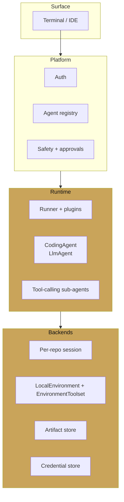
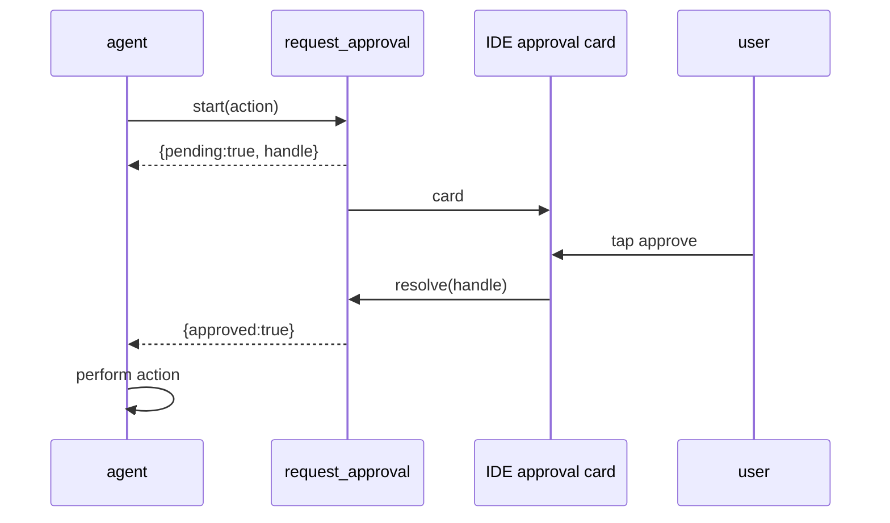

# Case study — a coding assistant harness

<span class="kicker">ch 19 · page 6 of 6</span>

A worked example of a harness you could actually ship: a coding
assistant like Cursor Agent, Aider, or Devin, but built on ADK. This
page is not a complete implementation — it is the architecture you
would follow if you sat down to build one tomorrow.

---

## What the user sees

- A terminal or IDE extension with an input field.
- Typed questions and commands in natural language.
- Files in the repo change; commits are proposed.
- Long-running operations (running tests, pushing to CI) show
  progress.
- The assistant respects the user's workspace: it reads files,
  writes files, runs commands, and — with approval — pushes to
  version control.



## The agent

```python
from google.adk.agents import LlmAgent
from google.adk.environment import LocalEnvironment
from google.adk.tools.environment import EnvironmentToolset
from google.adk.tools.long_running_tool import LongRunningFunctionTool


env = LocalEnvironment(workdir="/home/user/project")


def request_approval(action: str, reason: str) -> dict:
    """Ask the user to approve an irreversible action."""
    return {"pending": True, "handle": enqueue_ui_approval(action, reason)}


coding_agent = LlmAgent(
    name="coding_agent",
    model="gemini-2.5-pro",
    instruction="""
You are a coding assistant operating in the user's workspace.
You have access to read/write files, run commands, and call git.

Rules:
  - Prefer to read before editing. Summarise what you read briefly.
  - Never force-push, delete branches, or run `rm -rf`.
  - Call request_approval before:
      * modifying more than 5 files at once
      * running any network call
      * making any git operation that writes to the remote
""",
    tools=[
        EnvironmentToolset(env),
        LongRunningFunctionTool(func=request_approval),
    ],
)
```

The `EnvironmentToolset` gives the agent read/write and shell
access scoped to the workdir. `request_approval` pauses for
user input on the irreversible actions.

## The runner factory

```python
def runner_for(session_id: str, user: str, repo_root: str) -> Runner:
    env = LocalEnvironment(workdir=repo_root)
    agent = build_agent(env)
    return Runner(
        agent=agent,
        session_service=SqliteSessionService(f"{repo_root}/.adk/sessions.db"),
        memory_service=LocalMemoryService(f"{repo_root}/.adk/memory.db"),
        artifact_service=LocalArtifactService(f"{repo_root}/.adk/artifacts"),
        credential_service=KeychainCredentialService(user=user),
        plugins=[
            ToolAllowlistPlugin(allow=workspace_tool_allow(repo_root)),
            AuditPlugin(sink=JsonlSink(f"{repo_root}/.adk/audit.jsonl")),
            RetryPlugin(max_attempts=2),
            TracingPlugin(),
        ],
    )
```

Sessions live in a per-repo SQLite file. Memory is per-repo too —
the assistant remembers what it learned about *this* codebase
without leaking to others. Artifacts are stored under `.adk/`.

## The surface

Two surfaces, both thin:

### Terminal

```python
runner = runner_for(..., ...)
while True:
    line = input("> ")
    if not line: continue
    async for event in runner.run_async(
        user_id=user, session_id=sid,
        new_message=types.Content(role="user", parts=[types.Part(text=line)])):
        for p in (event.content.parts if event.content else []):
            if p.text: print(p.text, end="", flush=True)
    print()
```

### IDE extension

A WebSocket bridge between the IDE and a local daemon running the
runner. The IDE renders events into its own UI primitives
(diff view, approval buttons, progress cards).

## Approval UI



The IDE renders the card inline in the chat. Two buttons: *Approve
and proceed*, *Send back with notes*. The session resumes when
either fires.

## Multi-agent inside the harness

As the product grows:

- A `test_runner` sub-agent that only knows how to run and
  interpret tests.
- A `git` sub-agent with a tight allowlist of git commands.
- A `debugger` sub-agent that reads stack traces and proposes
  fixes.

Each is its own `LlmAgent` with its own tools. The coding agent
coordinates; delegation via `AgentTool` where the sub-agent should
return a single result, sub-agents via `sub_agents` where it
should speak directly to the user.

## Evaluation

A regression suite of `.test.json` cases: *"implement feature X in
this sample repo"*, *"fix the bug in this PR"*, *"explain this
function"*. Run on every agent change. Grade trajectory and final
state of the repo (did the tests pass after the change).

## Why the harness shape wins

- **Adding a new capability** — say, run a linter — is a new sub-agent
  + tool. No changes to the core.
- **Porting to a hosted version** — the local services become
  Vertex services; the agent code does not change.
- **Supporting another language** — add a language-specific
  sub-agent. The coding_agent routes to it.
- **Multi-tenant SaaS** — the factory already takes tenant context;
  you add the tenancy plugin and ship.

---

## Chapter recap

A harness is a platform-shaped agent system. ADK's primitives
(services, callbacks, plugins, composition, protocols) map onto the
platform layers directly. The result is a runtime that scales from
"one user in a terminal" to "ten thousand tenants on a managed
cloud service" without the code changing shape.

This is the chapter most agent frameworks cannot honestly write.
ADK can, and that is the strongest reason to pick it for the next
long-lived platform you build.
