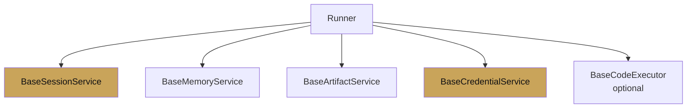

# Custom services

<span class="kicker">ch 19 · page 3 of 6</span>

Every ADK service is an interface. Implementing your own is the
right move when your harness has state that does not fit the stock
backends — usually because it is tenant-aware, billing-aware, or
bound to your existing infrastructure.

---

## The five interfaces



All except the code executor are required (or defaulted) on the
runner.

---

## `BaseSessionService`

The most commonly-overridden. The shape:

```python
from google.adk.sessions import BaseSessionService, Session

class TenantSessionService(BaseSessionService):
    def __init__(self, pg_pool, tenant_resolver):
        self._pg = pg_pool
        self._tenant = tenant_resolver

    async def create_session(self, *, app_name, user_id, state=None, session_id=None):
        tenant = self._tenant(user_id)
        row = await self._pg.fetchrow(
            "INSERT INTO sessions(tenant, app, user_id, state) "
            "VALUES($1,$2,$3,$4) RETURNING id, created_at",
            tenant, app_name, user_id, state or {})
        return Session(id=str(row["id"]), app_name=app_name, user_id=user_id,
                       state=state or {}, history=[], last_update_time=row["created_at"])

    async def get_session(self, *, app_name, user_id, session_id, config=None): ...
    async def list_sessions(self, *, app_name, user_id): ...
    async def append_event(self, session, event): ...
    async def delete_session(self, *, app_name, user_id, session_id): ...
```

Important invariants to preserve:

- **Prefix semantics.** `user:` / `app:` / `temp:` must do what the
  stock implementations do. Tenants will silently rely on this.
- **Event ordering.** `append_event` must preserve monotonicity
  per session.
- **State deltas must be atomic with events.** If you append an
  event but fail to persist the `state_delta`, replay diverges.
  Wrap in a transaction.

---

## `BaseMemoryService`

```python
from google.adk.memory import BaseMemoryService, MemoryResult

class TenantMemoryService(BaseMemoryService):
    async def add_session_to_memory(self, session):
        # Extract facts, write to tenant-scoped vector store
        ...
    async def search_memory(self, *, query, user_id, app_name):
        return MemoryResult(memories=[...])
```

For most harnesses, wrapping `VertexAiMemoryBankService` with
tenancy and quota enforcement is enough. Writing one from scratch
is only worth it if you have a strong reason to use a different
vector DB.

---

## `BaseArtifactService`

Backs file storage. If your harness writes artifacts to a
tenant-specific bucket, this is the layer.

```python
from google.adk.artifacts import BaseArtifactService
from google.genai import types

class GcsPerTenantArtifacts(BaseArtifactService):
    def __init__(self, bucket_fmt: str):
        self._fmt = bucket_fmt  # e.g. "agent-{tenant}-artifacts"

    async def save_artifact(self, *, app_name, user_id, session_id,
                             filename, artifact) -> int:
        tenant = lookup_tenant(user_id)
        bucket = self._fmt.format(tenant=tenant)
        ...
```

Version everything. Tenants will ask.

---

## `BaseCredentialService`

Often the most consequential. Credentials are the highest-stakes
thing your harness stores.

```python
from google.adk.auth import BaseCredentialService

class TenantCredentials(BaseCredentialService):
    async def get_credential(self, *, auth_config, context): ...
    async def save_credential(self, *, auth_config, credential, context): ...
```

Back it with Secret Manager or a dedicated secrets store. Never in
Postgres alongside session state.

---

## Testing your services

Every service implementation should pass the contract tests ADK
provides:

```python
from google.adk.sessions.testing import run_contract_tests

@pytest.mark.asyncio
async def test_my_session_service_contract():
    svc = TenantSessionService(...)
    await run_contract_tests(svc)
```

The contract tests verify state-prefix semantics, event ordering,
and invariants the runner relies on. Do not ship a service that
has not passed them.

---

## Why do this

- Every tenant's data lives in your infrastructure — row-level
  tenancy, backup semantics, retention, residency.
- Billing meters sit in the right place to count tokens, tool
  calls, and stored bytes.
- Incident response is easier: you can audit, export, and delete at
  the service level.

---

## Next

- [Multi-tenant](multi-tenant.md) — isolation and quotas.
