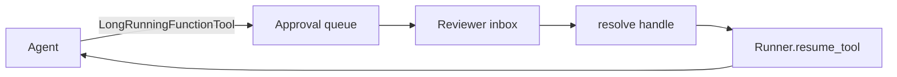

# Harness patterns

<span class="kicker">ch 19 · page 5 of 6</span>

Reusable patterns that recur across harnesses. Each one is a small
piece of code plus a bigger idea.

---

## Pattern 1 — agent registry

A central catalogue of agents that tenants can list, select, and
override. The registry stores either Agent Config YAML, a Python
module path, or an A2A agent card.

```python
@dataclass
class AgentRecord:
    id: str
    tenant: str                 # "default" or specific
    source: Literal["python", "yaml", "a2a"]
    path_or_url: str
    version: str

class Registry:
    def list(self, tenant): ...
    def load(self, tenant, agent_id) -> BaseAgent: ...
    def register(self, record): ...
```

## Pattern 2 — agent versioning

Each agent has a version. Tenants pin. Rolling forward is explicit.

```python
root = registry.load(tenant="acme", agent_id="support", version="v12")
```

## Pattern 3 — session rewind as a platform feature

Expose rewind as a user-facing button in the UI. When pressed:

```python
async def rewind_to(session_id, turn: int):
    session = await svc.get_session(...)
    truncated = session.model_copy(update={"history": session.history[:turn]})
    await svc.update_session(truncated)
```

Give it to support engineers first; give it to end users when you
trust the safety of re-run with a different model.

## Pattern 4 — safe tool allowlist per agent

Tools the agent *declares* are not the tools the platform *allows*.
The intersection is enforced at runtime.

```python
class ToolAllowlistPlugin(BasePlugin):
    def __init__(self, allow: dict[str, set[str]]):
        self._allow = allow      # agent_id -> set of tool names
    async def on_before_run(self, ctx):
        allowed = self._allow.get(ctx.agent.name, set())
        ctx.agent.tools = [t for t in ctx.agent.tools if t.name in allowed]
```

## Pattern 5 — approval queue as a service

Platform-owned inbox for pending approvals across all tenants. One
UI, many agents.



Implemented as a single table, a small API, and a generic inbox UI.
Any agent in the harness uses it without re-implementing.

## Pattern 6 — per-tenant feature flags

Plugins read flags; agents do not.

```python
class FeatureFlagPlugin(BasePlugin):
    def __init__(self, flags):
        self._flags = flags
    async def on_before_run(self, ctx):
        tenant = ctx.session.state.get("user:tenant")
        ctx.session.state["temp:features"] = self._flags.get(tenant, {})
```

## Pattern 7 — agent lifecycle hooks

Platform-owned hooks for *"when an agent is registered"*,
*"before first invocation"*, *"after deletion"*. Implement as
registry callbacks.

```python
registry.on_register(lambda r: provision_eval_set(r))
registry.on_delete(lambda r: archive_artifacts(r.tenant, r.id))
```

## Pattern 8 — dual-mode agents (text and voice)

For harnesses that support both modalities, agents stay single-mode
but expose a variant-resolver:

```python
def resolve_variant(base_agent, modality: Literal["text", "voice"]):
    if modality == "voice":
        return base_agent.model_copy(update={"model": "gemini-live-2.5-flash-native-audio"})
    return base_agent
```

The runner factory picks the variant by the incoming request.

## Pattern 9 — tenant-scoped MCP servers

Each tenant's MCP servers are launched per-session with tenant
credentials injected:

```python
def build_mcp_toolset(tenant):
    creds = cred_store.get(tenant, "notion")
    return MCPToolset(connection_params=StdioServerParameters(
        command="npx", args=["-y", "@notionhq/notion-mcp-server"],
        env={"OPENAPI_MCP_HEADERS": to_headers(creds)}))
```

## Pattern 10 — "harness agent" that manages other agents

A super-agent that knows about the registry and can orchestrate
across agents a tenant has registered.

```python
root = LlmAgent(
    name="meta",
    model="gemini-2.5-pro",
    instruction="Route the user's request to the best agent for the job.",
    sub_agents=[RemoteA2aAgent(name=a.id, agent_card=a.card_url)
                for a in registry.list_for(tenant)],
)
```

This is how the *Gemini Enterprise* pattern — one user-facing agent
that knows about dozens of first-party agents — is implemented.

---

## Next

- [Case study — a coding assistant harness](coding-assistant-harness.md).
