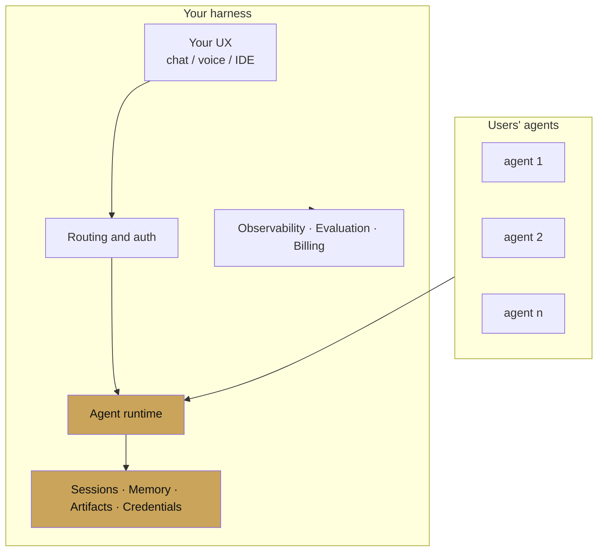

# Chapter 19 — ADK as a harness platform

chapter 19 · building the thing that runs other agents

This is the chapter written for readers who are not building an
agent — they are building the thing other teams will build agents
on. The platform. The harness. The runtime that is itself the
product.

If you have used Claude Code, Cursor, Devin, Replit Agent, or any
in-house "coding assistant" or "workflow orchestrator" — those are
harnesses. They are long-lived agent runtimes with their own UX,
session semantics, safety layer, billing, multi-tenancy, and
evaluation. ADK is unusually good at being the substrate for one.

---

## What a harness is

A harness is what you build when:

- Many agents, often written by many teams, run on one platform.
- The platform owns auth, quotas, billing, evaluation, and tracing.
- Agents get shipped independently, but they all execute inside the
  same runtime with the same guarantees.

ADK's pluggable `BaseAgent`, callbacks, plugins, services, and
open protocols map cleanly onto this shape.

---

## Why ADK fits harnesses

The seven design decisions from [Chapter 0](../00-introduction/why-adk.md)
compound when you are the platform, not the agent author:

1. **Every service is an interface.** You implement the backends
   for your platform (multi-tenant Postgres, per-tenant object
   store, your existing IAM), once, and every agent uses them.
2. **Events are the contract.** Your observability, billing, and
   audit pipelines read the event log — not instrumented agent
   code.
3. **Agents compose through `BaseAgent`.** Your harness can wrap,
   nest, or proxy any agent without knowing its internal structure.
4. **Callbacks and plugins are typed.** Cross-cutting policy is
   enforced by the platform, not by reminding agent authors to
   respect it.
5. **Multimodal and live are built in.** Your users will eventually
   ask for voice. You will not be rewriting.
6. **A2A is an open protocol.** Your tenants can import agents
   from outside your harness without special integration work.
7. **The migration cost is explicit.** Your agents stay the same
   code when your harness evolves.

---

## Pages

| Page | Covers |
|---|---|
| [Building a harness](building-a-harness.md) | The reference architecture |
| [Plugin architecture](plugin-architecture.md) | Cross-cutting runtime features |
| [Custom services](custom-services.md) | Implementing the five service interfaces |
| [Multi-tenant](multi-tenant.md) | Isolation, quotas, billing |
| [Harness patterns](harness-patterns.md) | Registries, agent loading, per-tenant overrides |
| [Case study — a coding assistant harness](coding-assistant-harness.md) | A Claude-Code-like harness in ADK |

---

## Prerequisites

You will get the most out of this chapter if you have read:

- [Chapter 2 — Core concepts](../02-core-concepts/index.md)
- [Chapter 11 — Observability](../11-observability/index.md)
- [Chapter 13 — Deployment](../13-deployment/index.md)
- [Chapter 14 — Safety](../14-safety/index.md)

If those are unfamiliar, read them first — this chapter assumes them.
