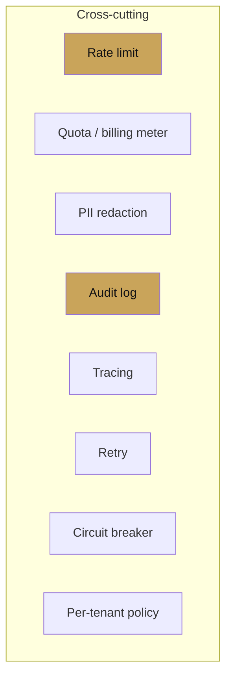

# Plugin architecture

<span class="kicker">ch 19 · page 2 of 6</span>

Plugins are ADK's answer to "cross-cutting concerns" — the things
every agent needs but no agent should implement itself. For a
harness, plugins are where most of the platform's value lives.

---

## What a plugin sees

```python
from google.adk.plugins.base_plugin import BasePlugin

class MyPlugin(BasePlugin):
    async def on_before_run(self, ctx): ...
    async def on_event(self, ctx, event): ...
    async def on_error(self, ctx, error): ...
    async def on_after_run(self, ctx): ...
```

The runner fires these around every invocation. The plugin has
access to the full `InvocationContext` — session, services, user,
and the agent tree.

Plugins run before and after *every* agent, tool, and model call
in the runner's scope. Attach once; they apply everywhere.

---

## The eight plugins a harness almost always wants



### 1. Rate limit

```python
class RateLimitPlugin(BasePlugin):
    def __init__(self, rps: float):
        self._bucket = TokenBucket(rps)
    async def on_before_run(self, ctx):
        await self._bucket.acquire()
```

### 2. Quota / billing meter

```python
class CostMeterPlugin(BasePlugin):
    def __init__(self, tenant: str):
        self._tenant = tenant
        self._cost = 0.0
    async def on_event(self, ctx, event):
        if event.usage_metadata:
            self._cost += cost_of(event.usage_metadata)
    async def on_after_run(self, ctx):
        await bill(self._tenant, self._cost, ctx.invocation_id)
```

### 3. PII redaction

```python
class PiiRedactionPlugin(BasePlugin):
    async def on_event(self, ctx, event):
        if event.content and event.content.parts:
            for p in event.content.parts:
                if p.text:
                    p.text = redact(p.text)
```

### 4. Audit log

```python
class AuditPlugin(BasePlugin):
    def __init__(self, sink): self._sink = sink
    async def on_event(self, ctx, event):
        await self._sink.write({
            "tenant": ctx.session.state.get("user:tenant"),
            "user": ctx.session.user_id,
            "session": ctx.session.id,
            "ts": event.timestamp,
            "author": event.author,
            "delta": event.actions.state_delta,
            "content": event.content.model_dump() if event.content else None,
        })
```

### 5. Tracing

Covered in [Chapter 11 — Tracing](../11-observability/tracing.md).
OTel spans with tenant attributes.

### 6. Retry

```python
class RetryPlugin(BasePlugin):
    def __init__(self, max_attempts: int = 3):
        self._max = max_attempts
    async def on_error(self, ctx, error):
        if is_retryable(error) and ctx.state.get("retries", 0) < self._max:
            ctx.state["retries"] = ctx.state.get("retries", 0) + 1
            return "retry"   # tells the runner to re-invoke
```

### 7. Circuit breaker

Stop hitting a failing backend. Short-circuit before it does.

```python
class CircuitBreakerPlugin(BasePlugin):
    def __init__(self):
        self._breakers: dict[str, Breaker] = {}
    async def on_before_run(self, ctx):
        for tool in walk_tools(ctx.agent):
            if self._breakers.get(tool.name, Breaker()).open:
                raise CircuitOpenError(tool.name)
```

### 8. Per-tenant policy

Composes tenant-specific allowlists, denylists, and feature flags.

```python
class PerTenantPolicy(BasePlugin):
    def __init__(self, tenant: str):
        self._cfg = policy_store.get(tenant)
    async def on_event(self, ctx, event):
        if event.content_has_tool_call(self._cfg.denied_tools):
            raise PolicyBlocked("tool denied")
```

---

## Ordering

Plugins fire in registration order. Put PII redaction before audit
(so audits are redacted); put rate limit before everything (cheap
rejection); put circuit breaker before retry.

A reasonable default composition:

```python
plugins = [
    RateLimitPlugin(rps=tenant.rps),
    CircuitBreakerPlugin(),
    PerTenantPolicy(tenant=tenant),
    PiiRedactionPlugin(),
    RetryPlugin(),
    CostMeterPlugin(tenant=tenant),
    AuditPlugin(sink=bq_audit),
    TracingPlugin(),
]
```

---

## Plugin vs callback

- **Plugins** are runner-scoped and apply to every agent in the
  runner. Best for platform concerns.
- **Callbacks** are agent-scoped. Best for agent-specific logic.

A harness author writes plugins; an agent author writes callbacks.
The separation is a governance boundary as much as a technical one.

---

## Next

- [Custom services](custom-services.md) — the interfaces for the
  four pluggable backends.
