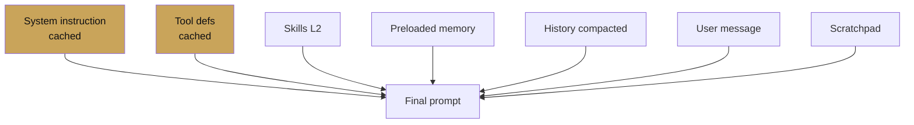

# Pattern: Context engineering

> Construct what the model sees deliberately. The prompt is the
> most important API in the system.

## When to use

Always. This is not an optional pattern.

## The shape

What the model sees on any turn:

1. System instruction (fixed, cacheable).
2. Tool definitions (fixed, cacheable).
3. Skills that have been promoted to L2 (from metadata-only).
4. Retrieved memories (if `preload_memory_tool`).
5. Session history — optionally compacted.
6. The user's new message.
7. The agent's scratchpad so far in this turn.

You own all seven. Each has a cost.

## Rules

- **Keep the fixed top cacheable.** Anything that varies per
  invocation forces re-cost. Put variables in user content, not
  in the instruction.
- **Pay attention to order.** Recent items dominate. Put the
  user's message last, not in the middle.
- **Compact before the history gets long.** See
  [Chapter 10 — Compaction](../10-memory-patterns/compaction.md).
- **Make retrieved context traceable.** If a memory or document
  shaped an answer, the event log should show it.

## Anti-patterns

- Stuffing everything into the system instruction.
- Appending tool-result preambles to every turn ("the
  lookup_order tool returned…"). The model already has that in
  `function_response` parts; do not duplicate.
- Re-summarising the user's last message into the instruction.
